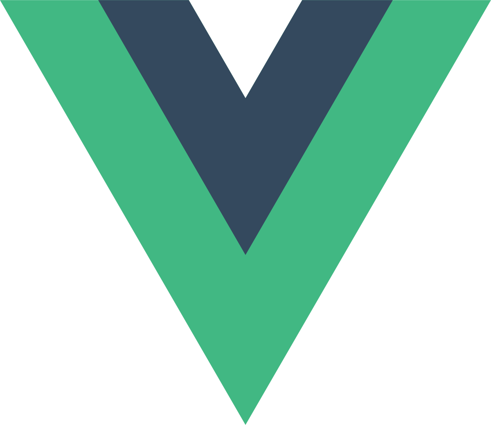
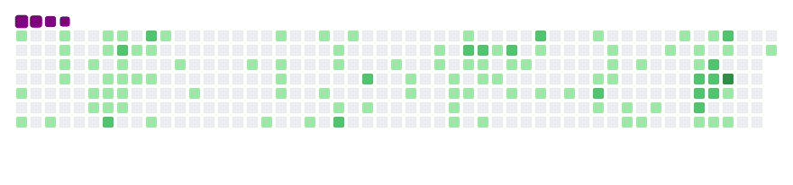

<h1 align="center">
  
</h1>

  
Hi I´m ✨Jose Santillan✨ Frontend Engineer from México
  
  👨‍💻 I love bringing designs to life  
  📚 I’m currently learning about advanced ReactJS and Cybersecurity  
  💬 <a target="_blank" href="https://api.whatsapp.com/send?phone=526771053138">Ask me <a/>anything about from  
  📫 How to reach me: <a href="mailto: josesantillan10@gmail.com">josesantillan10@gmail.com<a> 

 

<h2 align="center">🔥 Languages & Frameworks & Tools & Abilities 🔥</h2>
 

    <code></code>
    <code></code>
    <code></code>
    <code></code>
    <code></code>
    <code></code>
    <code></code>
    <code></code>
    <code></code>
    <code></code>
    <code></code>
    <code></code>

My contributions are being eaten

